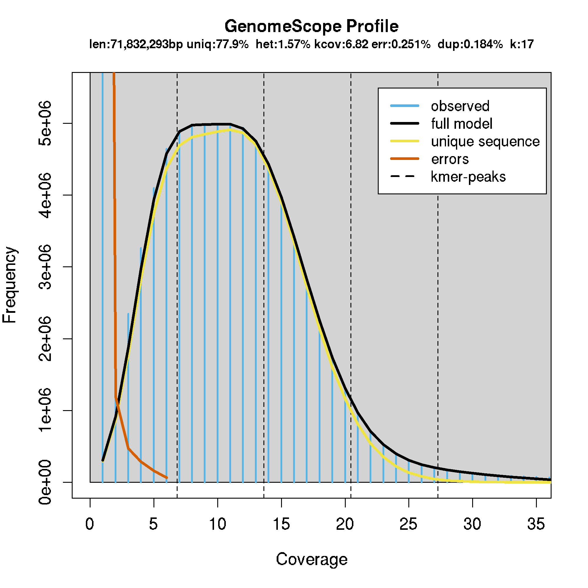
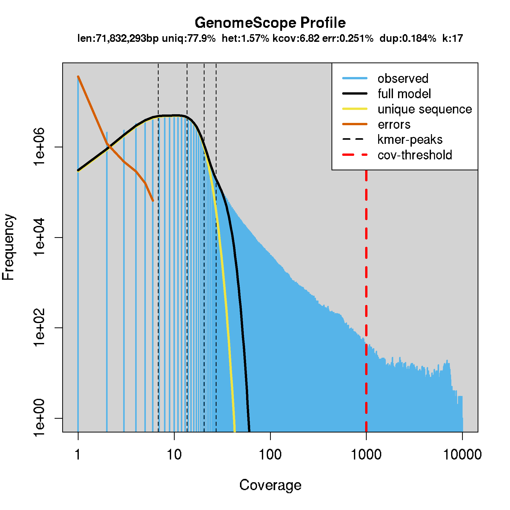
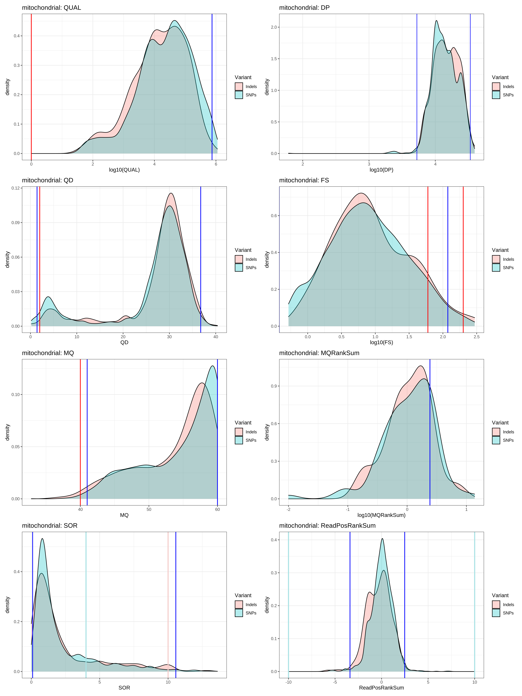
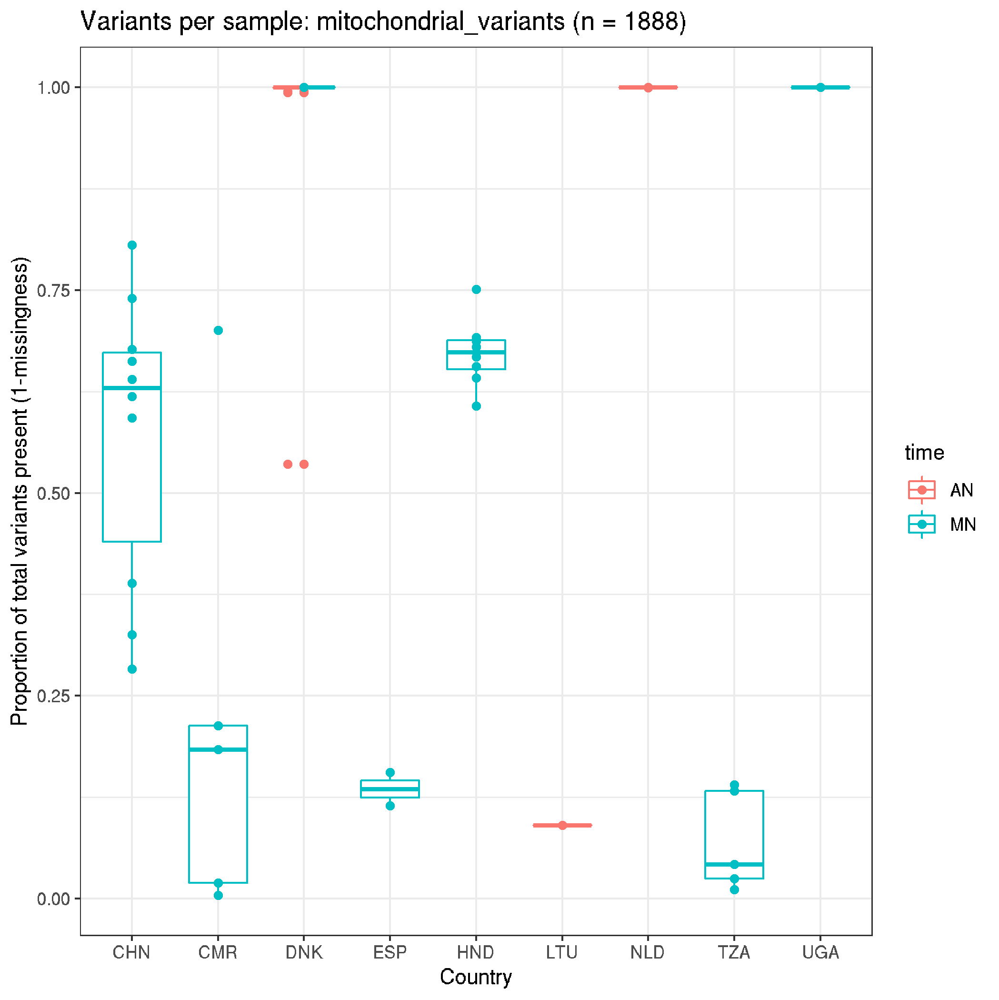
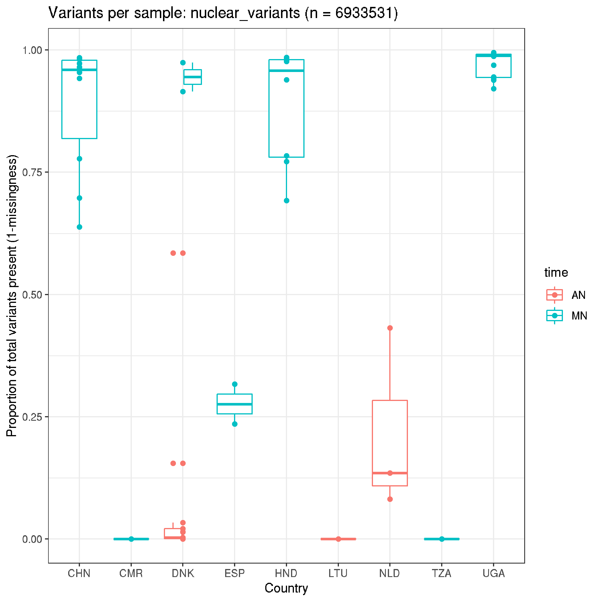

# Variant calling and filtering

## Contents
- Genome scope to estimate heterozyosity
- GATK
- Filter the VCF - SNPable
- Filter the VCF - hardfilter
- Querying SNP and INDEL QC profiles to determine thresholds for filters
- Applying filters to the variants
- merge VCFs
- Filter genotypes based on depth per genotype
- Sample missingness
- Generate an ALL SITES variant set for running pixy


## Genome scope to estimate heterozyosity
- Using genomescope to estimate heterozygosity from a couple of samples which can be used as an input to GATK genotyping

```bash

WORKING_DIR=/nfs/users/nfs_s/sd21/lustre118_link/trichuris_trichiura

mkdir ${WORKING_DIR}/02_RAW/GENOMESCOPE
cd ${WORKING_DIR}/02_RAW/GENOMESCOPE


jellyfish=/nfs/users/nfs_s/sd21/lustre118_link/software/COMPARATIVE_GENOMICS/jellyfish-2.2.6/bin/jellyfish
export LD_LIBRARY_PATH=${LD_LIBRARY_PATH}:/nfs/users/nfs_s/sd21/lustre118_link/software/COMPARATIVE_GENOMICS/jellyfish-2.2.6/lib
genomescope=/nfs/users/nfs_s/sd21/lustre118_link/software/COMPARATIVE_GENOMICS/genomescope/genomescope.R

echo -e "
export LD_LIBRARY_PATH=${LD_LIBRARY_PATH}:/nfs/users/nfs_s/sd21/lustre118_link/software/COMPARATIVE_GENOMICS/jellyfish-2.2.6/lib" > run_jellyfish2genomescope

while read OLD_NAME NEW_NAME; do
     echo -e "
     # run jellyfish to count kmers
     ${jellyfish} count -C -m 17 -s 1000000000 -t 10 ${WORKING_DIR}/02_RAW/${NEW_NAME}_PE.pair*.truncated -o ${NEW_NAME}.jellyfish.kmercount; \\
     # run jellyfish to make a histogram of kmers for input to genomescope
     ${jellyfish} histo -t 10 ${NEW_NAME}.jellyfish.kmercount > ${NEW_NAME}.jellyfish.histo;
     # run genomescope
     Rscript ${genomescope} ${NEW_NAME}.jellyfish.histo 17 100 ${NEW_NAME}.genomescope_out 1000" >> run_jellyfish2genomescope
done < ${WORKING_DIR}/modern.sample_list

chmod a+x run_jellyfish2genomescope

bsub.py --queue long --threads 10 20 jellyfish "./run_jellyfish2genomescope"

```

- once completed, opened histo files in genomescope (http://qb.cshl.edu/genomescope/)
- generally, the sequencing coverage was too low for this to work well. For most samples, the model failed to converge. However, some did work, shown below.
- heterozygosities:
     - MN_UGA_DK_HS_001: 0.0157
          - Model converged het:0.0157 kcov:6.82 err:0.00251 model fit:0.184 len:71832293
     - MN_UGA_KAB_HS_001:  0.0229
          - Model converged het:0.0229 kcov:7.33 err:0.00403 model fit:0.442 len:71863652
     - MN_UGA_KAB_HS_006: 0.0175
          - Model converged het:0.0175 kcov:8.87 err:0.0138 model fit:0.431 len:77034118
- GATK uses a heterozygosity default of 0.001, which is at least 10-fold lower than data here. Worth changing.

eg.




## GATK
- Using GATK haplotypecaller to call SNPs
- First pass QC: --min-base-quality-score 20 --minimum-mapping-quality 30
- scripts below split jobs by sample and by sequence, generating GVCFs, and then once done, merging them back together again. It does this by generating small jobs submitted in arrays to perform tasks in parallel, greatly speeding up the overall job time.

```bash
# working dir
WORKING_DIR=/nfs/users/nfs_s/sd21/lustre118_link/trichuris_trichiura

# load gatk
module load gatk/4.1.4.1

# also need htslib for tabix
module load common-apps/htslib/1.9.229

```

### Step 1. make GVCFs per sample

```bash
mkdir ${WORKING_DIR}/04_VARIANTS/GVCFS
cd ${WORKING_DIR}/04_VARIANTS/GVCFS

# create bam list using full path to bams - this allows bams to be anywhere
ls ${WORKING_DIR}/03_MAPPING/*.trimmed.bam > ${WORKING_DIR}/04_VARIANTS/bam.list_new

#new bams
#   ls ${WORKING_DIR}/03_MAPPING/AN_DNK_VIB_EN_0012.trimmed.bam ${WORKING_DIR}/03_MAPPING/AN_DNK_VIB_EN_345.trimmed.bam > ${WORKING_DIR}/04_VARIANTS/bam.list_new
#  ls ${WORKING_DIR}/03_MAPPING/AN_DNK_COA_EN_012.trimmed.bam  > ${WORKING_DIR}/04_VARIANTS/bam.list_new

BAM_LIST=${WORKING_DIR}/04_VARIANTS/bam.list

# rerun with new bams
#BAM_LIST=${WORKING_DIR}/04_VARIANTS/bam.list_new

REFERENCE=${WORKING_DIR}/01_REF/trichuris_trichiura.fa

# make a sequences list to allow splitting jobs per scaffold/contig
grep ">" ${WORKING_DIR}/01_REF/trichuris_trichiura.fa | sed -e 's/>//g' > ${WORKING_DIR}/04_VARIANTS/sequences.list

ulimit -c unlimited

# make jobs
while read BAM; do \
	n=1
	SAMPLE=$( echo ${BAM} | awk -F '/' '{print $NF}' | sed -e 's/.trimmed.bam//g' )
	mkdir ${SAMPLE}_GATK_HC_GVCF
	mkdir ${SAMPLE}_GATK_HC_GVCF/LOGFILES
	echo "gatk GatherVcfsCloud \\" > ${SAMPLE}_GATK_HC_GVCF/run_gather_${SAMPLE}_gvcf
	while read SEQUENCE; do
	echo -e "gatk HaplotypeCaller \\
          --input ${BAM} \\
          --output ${SAMPLE}_GATK_HC_GVCF/${n}.${SAMPLE}.${SEQUENCE}.tmp.gvcf.gz \\
          --reference ${REFERENCE} \\
          --intervals ${SEQUENCE} \\
          --heterozygosity 0.015 \\
          --indel-heterozygosity 0.01 \\
          --annotation DepthPerAlleleBySample --annotation Coverage --annotation ExcessHet --annotation FisherStrand --annotation MappingQualityRankSumTest --annotation StrandOddsRatio --annotation RMSMappingQuality --annotation ReadPosRankSumTest --annotation DepthPerSampleHC --annotation QualByDepth \\
          --min-base-quality-score 20 --minimum-mapping-quality 30 --standard-min-confidence-threshold-for-calling 30 \\
          --emit-ref-confidence GVCF " > ${SAMPLE}_GATK_HC_GVCF/run_hc_${SAMPLE}.${SEQUENCE}.tmp.job_${n};
	echo -e "--input ${PWD}/${SAMPLE}_GATK_HC_GVCF/${n}.${SAMPLE}.${SEQUENCE}.tmp.gvcf.gz \\" >> ${SAMPLE}_GATK_HC_GVCF/run_gather_${SAMPLE}_gvcf;
	let "n+=1"; done < ${WORKING_DIR}/04_VARIANTS/sequences.list;

	echo -e "--output ${PWD}/${SAMPLE}_GATK_HC_GVCF/${SAMPLE}.gvcf.gz; tabix -p vcf ${PWD}/${SAMPLE}_GATK_HC_GVCF/${SAMPLE}.gvcf.gz" >> ${SAMPLE}_GATK_HC_GVCF/run_gather_${SAMPLE}_gvcf;

	echo -e "rm ${PWD}/${SAMPLE}_GATK_HC_GVCF/*.tmp.* && \\
          mv ${PWD}/${SAMPLE}_GATK_HC_GVCF/*.[oe] ${PWD}/${SAMPLE}_GATK_HC_GVCF/LOGFILES && \\
          cd ${PWD} && \\
          mv ${PWD}/${SAMPLE}_GATK_HC_GVCF ${PWD}/${SAMPLE}_GATK_HC_GVCF_complete" > ${SAMPLE}_GATK_HC_GVCF/run_clean_${SAMPLE};

	chmod a+x ${SAMPLE}_GATK_HC_GVCF/run_*

	# setup job conditions
	JOBS=$( ls -1 ${SAMPLE}_GATK_HC_GVCF/run_hc_* | wc -l )
	ID="U$(date +%s)"

	#submit job array to call variants put scaffold / contig
	bsub -q long -R'span[hosts=1] select[mem>15000] rusage[mem=15000]' -n 6 -M15000 -J GATK_HC_${ID}_[1-${JOBS}]%100 -e ${SAMPLE}_GATK_HC_GVCF/GATK_HC_${ID}_[1-${JOBS}].e -o ${SAMPLE}_GATK_HC_GVCF/GATK_HC_${ID}_[1-${JOBS}].o "./${SAMPLE}_GATK_HC_GVCF/run_hc_${SAMPLE}.*job_\$LSB_JOBINDEX"

	#submit job to gather gvcfs into a single, per sample gvcf
	bsub -q normal -w "done(GATK_HC_${ID}_[1-$JOBS])" -R'span[hosts=1] select[mem>500] rusage[mem=500]' -n 1 -M500 -J GATK_HC_${ID}_gather_gvcfs -e ${SAMPLE}_GATK_HC_GVCF/GATK_HC_${ID}_gather_gvcfs.e -o ${SAMPLE}_GATK_HC_GVCF/GATK_HC_${ID}_gather_gvcfs.o "./${SAMPLE}_GATK_HC_GVCF/run_gather_${SAMPLE}_gvcf"

	# clean up
	bsub -q normal -w "done(GATK_HC_${ID}_gather_gvcfs)" -R'span[hosts=1] select[mem>500] rusage[mem=500]' -n 1 -M500 -J GATK_HC_${ID}_clean -e ${SAMPLE}_GATK_HC_GVCF/GATK_HC_${ID}_clean.e -o ${SAMPLE}_GATK_HC_GVCF/GATK_HC_${ID}_clean.o "./${SAMPLE}_GATK_HC_GVCF/run_clean_${SAMPLE}"

	sleep 1
done < ${BAM_LIST}

```

### Step 2. Gather the GVCFs to generate a merged GVCF

```bash

# make a new directory for the merged GVCFS
mkdir ${WORKING_DIR}/04_VARIANTS/GATK_HC_MERGED
cd ${WORKING_DIR}/04_VARIANTS/GATK_HC_MERGED

# make a list of GVCFs to be merged
ls -1 ${WORKING_DIR}/04_VARIANTS/GVCFS/*complete/*gz > ${WORKING_DIR}/04_VARIANTS/GATK_HC_MERGED/gvcf.list

GVCF_LIST=${WORKING_DIR}/04_VARIANTS/GATK_HC_MERGED/gvcf.list

REFERENCE=${WORKING_DIR}/01_REF/trichuris_trichiura.fa


# setup the run files
n=1
while read SEQUENCE; do
     echo -e "gatk CombineGVCFs -R ${REFERENCE} --intervals ${SEQUENCE} \\" > ${n}.run_merge_gvcfs.tmp.${SEQUENCE}
     while read SAMPLE; do
          echo -e "--variant ${SAMPLE} \\" >> ${n}.run_merge_gvcfs.tmp.${SEQUENCE};
     done < ${GVCF_LIST}
     echo -e "--output ${SEQUENCE}.cohort.g.vcf.gz" >> ${n}.run_merge_gvcfs.tmp.${SEQUENCE};
     let "n+=1";
done < ${WORKING_DIR}/04_VARIANTS/sequences.list

chmod a+x *.run_merge_gvcfs.tmp.*

# run
for i in *.run_merge_gvcfs.tmp.*; do
     bsub.py --queue long --threads 4 10 merge_vcfs "./${i}";
done

# threads seem to make a big difference in run time, even though they are not a parameter in the tool

```

### Step 3. Split merged GVCF into individual sequences, and then genotype to generate a VCF

```bash

# split each chromosome up into separate jobs, and run genotyping on each individually.
n=1

while read SEQUENCE; do
     echo -e "gatk GenotypeGVCFs \
     -R ${REFERENCE} \
     -V ${SEQUENCE}.cohort.g.vcf.gz \
     --intervals ${SEQUENCE} \
     --heterozygosity 0.015 \
     --indel-heterozygosity 0.01 \
     --annotation DepthPerAlleleBySample --annotation Coverage --annotation ExcessHet --annotation FisherStrand --annotation MappingQualityRankSumTest --annotation StrandOddsRatio --annotation RMSMappingQuality --annotation ReadPosRankSumTest --annotation DepthPerSampleHC --annotation QualByDepth \
     -O ${n}.${SEQUENCE}.cohort.vcf.gz" > run_hc_genotype.${SEQUENCE}.tmp.job_${n};
     let "n+=1";
done < ${WORKING_DIR}/04_VARIANTS/sequences.list

chmod a+x run_hc_genotype*

mkdir LOGFILES

# setup job conditions
JOBS=$( ls -1 run_hc_* | wc -l )
ID="U$(date +%s)"

# run
bsub -q long -R'span[hosts=1] select[mem>10000] rusage[mem=10000]' -n 4 -M10000 -J GATK_HC_GENOTYPE_${ID}_[1-$JOBS] -e LOGFILES/GATK_HC_GENOTYPE_${ID}_[1-$JOBS].e -o LOGFILES/GATK_HC_GENOTYPE_${ID}_[1-$JOBS].o "./run_hc_*\$LSB_JOBINDEX"

```

### Step 4. Bring the files together

```bash

# make list of vcfs
ls -1 *.cohort.vcf.gz | sort -n > vcf_files.list

# merge them
vcf-concat --files vcf_files.list > Trichuris_trichiura.cohort.vcf;
     bgzip Trichuris_trichiura.cohort.vcf;
     tabix -p vcf Trichuris_trichiura.cohort.vcf.gz

# clean up
rm run*
rm ^[0-9]*
rm *.g.vcf.gz*

```


## Filter the VCF - SNPable
Using Heng Li's "SNPable regions" to identify unique regions fo the genome in which mapping tends to be more reliable. Martin did this, so thought i'd give it a go to be consistent

http://lh3lh3.users.sourceforge.net/snpable.shtml

```bash

cd ~/lustre118_link/trichuris_trichiura/01_REF/SNPABLE

cp ../trichuris_trichiura.fa .

# make reads from the reference genome
~sd21/lustre118_link/software/SNP_CALLING/seqbility-20091110/splitfa trichuris_trichiura.fa 35 | split -l 20000000

# index the reference
bwa index trichuris_trichiura.fa

# map the reads generated from the reference back to the reference
echo -e 'for i in x*; do bwa aln -R 1000000 -O 3 -E 3 trichuris_trichiura.fa ${i} > ${i}.sai; done' > run_bwa

chmod a+x run_bwa

bsub.py 10 bwaaln ./run_bwa

# once mapping is completed, compress to save space
gzip *out.sam

# make the raw mask
gzip -dc x??.out.sam.gz | ~/lustre118_link/software/SNP_CALLING/seqbility-20091110/gen_raw_mask.pl > rawMask_35.fa

# make the final mask
~/lustre118_link/software/SNP_CALLING/seqbility-20091110/gen_mask -l 35 -r 0.5 rawMask_35.fa > mask_35_50.fa

# make bed files per chromosome of the category 3 positions,
python makeMappabilityMask.py

# position categories
# c=3: the majortiy of overlapping 35-mers are mapped uniquely and without 1-mismatch (or 1-difference, depending on the BWA command line) hits.
# c=2: the majority of overlapping 35-mers are unique and c!=3.
# c=1: the majority of overlapping 35-mers are non-unique.
# c=0: all the 35-mers overlapping x cannot be mapped due to excessive ambiguous bases.

# count how many positions for each position in the genome
for i in 0 1 2 3; do
     echo -e "SNPtype: ${i}";
     cat mask_35_50.fa | grep -v ">" | grep -o "${i}" | wc -l;
done

#SNPtype: 0
#249900

#SNPtype: 1
#13754267

#SNPtype: 2
#6119809

#SNPtype: 3
#60449735

```

- given the genome is 80573711 bp, the proportion of type 3 postions (n = 60449735) is 75.02%
- this is an interesting strategy - perhaps worth exploring for other projects, esp when just popgen SNPs are being used (not every position for, eg, SNPeff).


## Hard filters

```bash
mkdir ${WORKING_DIR}/04_VARIANTS/SNP_FILTER
cd ${WORKING_DIR}/04_VARIANTS/SNP_FILTER

# run hard filter
${WORKING_DIR}/00_SCRIPTS/run_variant-hardfilter.sh TT ${WORKING_DIR}/01_REF/trichuris_trichiura.fa ${WORKING_DIR}/04_VARIANTS/04_VARIANTS/Trichuris_trichiura.cohort.vcf.gz

vcftools --vcf TT.filtered-2.vcf.recode.vcf
#> After filtering, kept 61 out of 61 Individuals
#> After filtering, kept 9240001 out of a possible 9240001 Sites

# apply the SNPable mask
vcftools --vcf TT.filtered-2.vcf.recode.vcf --bed ${WORKING_DIR}/01_REF/SNPABLE/mask.bed

# After filtering, kept 8371588 out of a possible 9240001 Sites

```


## Querying SNP and INDEL QC profiles to determine thresholds for filters
Adapted from https://evodify.com/gatk-in-non-model-organism/

```bash

# load gatk
module load gatk/4.1.4.1

WORKING_DIR=/nfs/users/nfs_s/sd21/lustre118_link/trichuris_trichiura

cd ${WORKING_DIR}/04_VARIANTS/GATK_HC_MERGED/FILTER

# set reference, vcf, and mitochondrial contig
REFERENCE=${WORKING_DIR}/01_REF/trichuris_trichiura.fa
VCF=${WORKING_DIR}/04_VARIANTS/GATK_HC_MERGED/Trichuris_trichiura.cohort.vcf.gz
MITOCHONDRIAL_CONTIG=Trichuris_trichiura_MITO

# select nuclear SNPs
bsub.py 1 select_nuclearSNPs "gatk SelectVariants \
--reference ${REFERENCE} \
--variant ${VCF} \
--select-type-to-include SNP \
--exclude-intervals ${MITOCHONDRIAL_CONTIG} \
--output ${VCF%.vcf.gz}.nuclearSNPs.vcf"

# select nuclear INDELs
bsub.py 1 select_nuclearINDELs "gatk SelectVariants \
--reference ${REFERENCE} \
--variant ${VCF} \
--select-type-to-include INDEL \
--exclude-intervals ${MITOCHONDRIAL_CONTIG} \
--output ${VCF%.vcf.gz}.nuclearINDELs.vcf"

# select mitochondrial SNPs
bsub.py 1 select_mitoSNPs "gatk SelectVariants \
--reference ${REFERENCE} \
--variant ${VCF} \
--select-type-to-include SNP \
--intervals ${MITOCHONDRIAL_CONTIG} \
--output ${VCF%.vcf.gz}.mitoSNPs.vcf"

# select mitochondrial INDELs
bsub.py 1 select_mitoINDELs "gatk SelectVariants \
--reference ${REFERENCE} \
--variant ${VCF} \
--select-type-to-include INDEL \
--intervals ${MITOCHONDRIAL_CONTIG} \
--output ${VCF%.vcf.gz}.mitoINDELs.vcf"


# make a table of nuclear SNP data
bsub.py 1 select_nuclearSNPs_table "gatk VariantsToTable \
--reference ${REFERENCE} \
--variant ${VCF%.vcf.gz}.nuclearSNPs.vcf \
--fields CHROM --fields POS --fields QUAL --fields QD --fields DP --fields MQ --fields MQRankSum --fields FS --fields ReadPosRankSum --fields SOR \
--output GVCFall_nuclearSNPs.table"

# make a table of nuclear INDEL data data
bsub.py 1 select_nuclearINDELs_table "gatk VariantsToTable \
--reference ${REFERENCE} \
--variant ${VCF%.vcf.gz}.nuclearINDELs.vcf \
--fields CHROM --fields POS --fields QUAL --fields QD --fields DP --fields MQ --fields MQRankSum --fields FS --fields ReadPosRankSum --fields SOR \
--output GVCFall_nuclearINDELs.table"

# make a table of mito SNP data
bsub.py --done "select_mitoSNPs" 1 select_mitoSNPs_table "gatk VariantsToTable \
--reference ${REFERENCE} \
--variant ${VCF%.vcf.gz}.mitoSNPs.vcf \
--fields CHROM --fields POS --fields QUAL --fields QD --fields DP --fields MQ --fields MQRankSum --fields FS --fields ReadPosRankSum --fields SOR \
--output GVCFall_mitoSNPs.table"

# make a table of mito INDEL data data
bsub.py --done "select_mitoINDELs"  1 select_mitoINDELs_table "gatk VariantsToTable \
--reference ${REFERENCE} \
--variant ${VCF%.vcf.gz}.mitoINDELs.vcf \
--fields CHROM --fields POS --fields QUAL --fields QD --fields DP --fields MQ --fields MQRankSum --fields FS --fields ReadPosRankSum --fields SOR \
--output GVCFall_mitoINDELs.table"


# make some density plots of the data
bsub.py 1 variant_summaries "Rscript ${WORKING_DIR}/00_SCRIPTS/plot_variant_summaries.R"

```

where "plot_variant_summaries.R" is:

```R

# load libraries
library(patchwork)
require(data.table)
library(tidyverse)
library(gridExtra)

VCF_nuclear_snps <- fread('GVCFall_nuclearSNPs.table', header = TRUE, fill=TRUE, na.strings=c("","NA"), sep = "\t")
VCF_nuclear_snps <- sample_frac(VCF_nuclear_snps, 0.2)
VCF_nuclear_indels <- fread('GVCFall_nuclearINDELs.table', header = TRUE, fill=TRUE, na.strings=c("","NA"), sep = "\t")
VCF_nuclear_indels <- sample_frac(VCF_nuclear_indels, 0.2)
dim(VCF_nuclear_snps)
dim(VCF_nuclear_indels)
VCF_nuclear <- rbind(VCF_nuclear_snps, VCF_nuclear_indels)
VCF_nuclear$Variant <- factor(c(rep("SNPs", dim(VCF_nuclear_snps)[1]), rep("Indels", dim(VCF_nuclear_indels)[1])))

VCF_mito_snps <- fread('GVCFall_mitoSNPs.table', header = TRUE, fill=TRUE, na.strings=c("","NA"), sep = "\t")
VCF_mito_indels <- fread('GVCFall_mitoINDELs.table', header = TRUE, fill=TRUE, na.strings=c("","NA"), sep = "\t")
dim(VCF_mito_snps)
dim(VCF_mito_indels)
VCF_mito <- rbind(VCF_mito_snps, VCF_mito_indels)
VCF_mito$Variant <- factor(c(rep("SNPs", dim(VCF_mito_snps)[1]), rep("Indels", dim(VCF_mito_indels)[1])))


snps <- '#A9E2E4'
indels <- '#F4CCCA'

fun_variant_summaries <- function(data, title){
# gatk hardfilter: SNP & INDEL QUAL < 0
QUAL_quant <- quantile(data$QUAL, c(.01,.99), na.rm=T)

QUAL <-
     ggplot(data, aes(x=log10(QUAL), fill=Variant)) +
     geom_density(alpha=.3) +
     geom_vline(xintercept=0, size=0.7, col="red") +
     geom_vline(xintercept=c(log10(QUAL_quant[2]), log10(QUAL_quant[3])), size=0.7, col="blue") +
     #xlim(0,10000) +
     theme_bw() +
     labs(title=paste0(title,": QUAL"))


# DP doesnt have a hardfilter
DP_quant <- quantile(data$DP, c(.01,.99), na.rm=T)

DP <-
     ggplot(data, aes(x=log10(DP), fill=Variant)) +
     geom_density(alpha=0.3) +
     geom_vline(xintercept=log10(DP_quant), col="blue") +
     theme_bw() +
     labs(title=paste0(title,": DP"))

# gatk hardfilter: SNP & INDEL QD < 2
QD_quant <- quantile(data$QD, c(.01,.99), na.rm=T)

QD <-
     ggplot(data, aes(x=QD, fill=Variant)) +
     geom_density(alpha=.3) +
     geom_vline(xintercept=2, size=0.7, col="red") +
     geom_vline(xintercept=QD_quant, size=0.7, col="blue") +
     theme_bw() +
     labs(title=paste0(title,": QD"))

# gatk hardfilter: SNP FS > 60, INDEL FS > 200
FS_quant <- quantile(data$FS, c(.01,.99), na.rm=T)

FS <-
     ggplot(data, aes(x=log10(FS), fill=Variant)) +
     geom_density(alpha=.3) +
     geom_vline(xintercept=c(log10(60), log10(200)), size=0.7, col="red") +
     geom_vline(xintercept=log10(FS_quant), size=0.7, col="blue") +
     #xlim(0,250) +
     theme_bw() +
     labs(title=paste0(title,": FS"))

# gatk hardfilter: SNP & INDEL MQ < 30
MQ_quant <- quantile(data$MQ, c(.01,.99), na.rm=T)

MQ <-
     ggplot(data, aes(x=MQ, fill=Variant)) + geom_density(alpha=.3) +
     geom_vline(xintercept=40, size=0.7, col="red") +
     geom_vline(xintercept=MQ_quant, size=0.7, col="blue") +
     theme_bw() +
     labs(title=paste0(title,": MQ"))

# gatk hardfilter: SNP MQRankSum < -20
MQRankSum_quant <- quantile(data$MQRankSum, c(.01,.99), na.rm=T)

MQRankSum <-
     ggplot(data, aes(x=log10(MQRankSum), fill=Variant)) + geom_density(alpha=.3) +
     geom_vline(xintercept=log10(-20), size=0.7, col="red") +
     geom_vline(xintercept=log10(MQRankSum_quant), size=0.7, col="blue") +
     theme_bw() +
     labs(title=paste0(title,": MQRankSum"))


# gatk hardfilter: SNP SOR < 4 , INDEL SOR > 10
SOR_quant <- quantile(data$SOR, c(.01, .99), na.rm=T)

SOR <-
     ggplot(data, aes(x=SOR, fill=Variant)) +
     geom_density(alpha=.3) +
     geom_vline(xintercept=c(4, 10), size=1, colour = c(snps,indels)) +
     geom_vline(xintercept=SOR_quant, size=0.7, col="blue") +
     theme_bw() +
     labs(title=paste0(title,": SOR"))

# gatk hardfilter: SNP ReadPosRankSum <-10 , INDEL ReadPosRankSum < -20
ReadPosRankSum_quant <- quantile(data$ReadPosRankSum, c(.01,.99), na.rm=T)

ReadPosRankSum <-
     ggplot(data, aes(x=ReadPosRankSum, fill=Variant)) +
     geom_density(alpha=.3) +
     geom_vline(xintercept=c(-10,10,-20,20), size=1, colour = c(snps,snps,indels,indels)) +
     xlim(-10, 10) +
     geom_vline(xintercept=ReadPosRankSum_quant, size=0.7, col="blue") +
     theme_bw() +
     labs(title=paste0(title,": ReadPosRankSum"))


plot <- QUAL + DP + QD + FS + MQ + MQRankSum + SOR + ReadPosRankSum + plot_layout(ncol=2)

print(plot)

ggsave(paste0("plot_",title,"_variant_summaries.png"), height=20, width=15, type="cairo")


# generate a table of quantiles for each variant feature
QUAL_quant <- data %>% group_by(Variant) %>% summarise(quants = list(quantile(QUAL, probs = c(0.01,0.05,0.95,0.99),na.rm=T))) %>% unnest_wider(quants)
QUAL_quant$name <- "QUAL"
DP_quant <- data %>% group_by(Variant) %>% summarise(quants = list(quantile(DP, probs = c(0.01,0.05,0.95,0.99),na.rm=T))) %>% unnest_wider(quants)
DP_quant$name <- "DP"
QD_quant <- data %>% group_by(Variant) %>% summarise(quants = list(quantile(QD, probs = c(0.01,0.05,0.95,0.99),na.rm=T))) %>% unnest_wider(quants)
QD_quant$name <- "QD"
FS_quant <- data %>% group_by(Variant) %>% summarise(quants = list(quantile(FS, probs = c(0.01,0.05,0.95,0.99),na.rm=T))) %>% unnest_wider(quants)
FS_quant$name <- "FS"
MQ_quant <- data %>% group_by(Variant) %>% summarise(quants = list(quantile(MQ, probs = c(0.01,0.05,0.95,0.99),na.rm=T))) %>% unnest_wider(quants)
MQ_quant$name <- "MQ"
MQRankSum_quant <- data %>% group_by(Variant) %>% summarise(quants = list(quantile(MQRankSum, probs = c(0.01,0.05,0.95,0.99),na.rm=T))) %>% unnest_wider(quants)
MQRankSum_quant$name <- "MQRankSum"
SOR_quant <- data %>% group_by(Variant) %>% summarise(quants = list(quantile(SOR, probs = c(0.01,0.05,0.95,0.99),na.rm=T))) %>% unnest_wider(quants)
SOR_quant$name <- "SOR"
ReadPosRankSum_quant <- data %>% group_by(Variant) %>% summarise(quants = list(quantile(ReadPosRankSum, probs = c(0.01,0.05,0.95,0.99),na.rm=T))) %>% unnest_wider(quants)
ReadPosRankSum_quant$name <- "ReadPosRankSum"

quantiles <- bind_rows(QUAL_quant,DP_quant, QD_quant, FS_quant, MQ_quant, MQRankSum_quant, SOR_quant, ReadPosRankSum_quant)
quantiles$name <- c("QUAL_Indels","QUAL_SNPs","DP_indels","DP_SNPs", "QD_indels","QD_SNPs", "FS_indels","FS_SNPs", "MQ_indels","MQ_SNPs", "MQRankSum_indels","MQRankSum_SNPs", "SOR_indels","SOR_SNPs","ReadPosRankSum_indels","ReadPosRankSum_SNPs")

png(paste0("table_",title,"_variant_quantiles.png"), width=1000,height=500,bg = "white")
print(quantiles)
grid.table(quantiles)
dev.off()

}

# run mitochondrial variants
fun_variant_summaries(VCF_mito,"mitochondrial")

# run nuclear variants
fun_variant_summaries(VCF_nuclear,"nuclear")

```

- mitochondrial_variant_summaries

- nuclear_variant_summaries


- Table: mitochondrial_variant_quantiles

- Table: nuclear_variant_quantiles


- GATK hard filters are as follows
     - (https://gatk.broadinstitute.org/hc/en-us/articles/360035890471-Hard-filtering-germline-short-variants):
     - SNPs
          -filter "QD < 2.0" --filter-name "QD2" \
          -filter "QUAL < 30.0" --filter-name "QUAL30" \
          -filter "SOR > 3.0" --filter-name "SOR3" \
          -filter "FS > 60.0" --filter-name "FS60" \
          -filter "MQ < 40.0" --filter-name "MQ40" \
          -filter "MQRankSum < -12.5" --filter-name "MQRankSum-12.5" \
          -filter "ReadPosRankSum < -8.0" --filter-name "ReadPosRankSum-8" \
     - INDELs
          -filter "QD < 2.0" --filter-name "QD2" \
         -filter "QUAL < 30.0" --filter-name "QUAL30" \
         -filter "FS > 200.0" --filter-name "FS200" \
         -filter "ReadPosRankSum < -20.0" --filter-name "ReadPosRankSum-20" \
- based on the plots / quantiles data, using the distributions seems to be even more stringent that the GATK hardfiltering
- I think using the quantiles are the correct way to proceed.


## Applying filters to the variants
```bash
# apply filtering to SNPs
WORKING_DIR=/nfs/users/nfs_s/sd21/lustre118_link/trichuris_trichiura
REFERENCE=${WORKING_DIR}/01_REF/trichuris_trichiura.fa
VCF=${WORKING_DIR}/04_VARIANTS/GATK_HC_MERGED/Trichuris_trichiura.cohort.vcf.gz


bsub.py 1 filter_nuclearSNPs "gatk VariantFiltration \
--reference ${REFERENCE} \
--variant ${VCF%.vcf.gz}.nuclearSNPs.vcf \
--filter-expression 'QUAL < 46 || DP < 50 || DP > 793 || MQ < 38.00 || SOR > 3.600 || QD < 3.00 || FS > 9.400 || MQRankSum < -2.800 || ReadPosRankSum < -1.800 || ReadPosRankSum > 2.200' \
--filter-name "SNP_filtered" \
--output ${VCF%.vcf.gz}.nuclearSNPs.filtered.vcf"

bsub.py 1 filter_nuclearINDELs "gatk VariantFiltration \
--reference ${REFERENCE} \
--variant ${VCF%.vcf.gz}.nuclearINDELs.vcf \
--filter-expression 'QUAL < 30 || DP < 208 || DP > 897 || MQ < 38.00 || SOR > 3.900 || QD < 3.00 || FS > 7.800 || MQRankSum < -3.000 || ReadPosRankSum < -2.200 || ReadPosRankSum > 2.2000' \
--filter-name "INDEL_filtered" \
--output ${VCF%.vcf.gz}.nuclearINDELs.filtered.vcf"


bsub.py 1 filter_mitoSNPs "gatk VariantFiltration \
--reference ${REFERENCE} \
--variant ${VCF%.vcf.gz}.mitoSNPs.vcf \
--filter-expression ' QUAL < 66 || DP < 5057 || DP > 30456 || MQ < 41.00 || SOR > 10.000 || QD < 1.4 || FS > 33.8 || MQRankSum < -6.3 || ReadPosRankSum < -3.9 || ReadPosRankSum > 4.1 ' \
--filter-name "SNP_filtered" \
--output ${VCF%.vcf.gz}.mitoSNPs.filtered.vcf"

bsub.py 1 filter_mitoINDELs "gatk VariantFiltration \
--reference ${REFERENCE} \
--variant ${VCF%.vcf.gz}.mitoINDELs.vcf \
--filter-expression 'QUAL < 107 || DP < 6357 || DP > 33076 || MQ < 40.00 || SOR > 10.000 || QD < 3.1 || FS > 21.2 || ReadPosRankSum < -4.5 || ReadPosRankSum > 3.7' \
--filter-name "INDEL_filtered" \
--output ${VCF%.vcf.gz}.mitoINDELs.filtered.vcf"


# once done, count the filtered sites - funny use of "|" allows direct markdown table format
echo -e "| Filtered_VCF | Variants_PASS | Variants_FILTERED |\n| -- | -- | -- | " > filter.stats

for i in *filtered.vcf; do
     name=${i}; pass=$( grep -E 'PASS' ${i} | wc -l ); filter=$( grep -E 'filter' ${i} | wc -l );
     echo -e "| ${name} | ${pass} | ${filter} |" >> filter.stats
done

```

- Table: "filter.stats"

| Filtered_VCF | Variants_PASS | Variants_FILTERED |
| -- | -- | -- |
| Trichuris_trichiura.cohort.mitoINDELs.filtered.vcf | 339 | 53 |
| Trichuris_trichiura.cohort.mitoSNPs.filtered.vcf | 2141 | 284 |
| Trichuris_trichiura.cohort.nuclearINDELs.filtered.vcf | 847369 | 132345 |
| Trichuris_trichiura.cohort.nuclearSNPs.filtered.vcf | 9052538 | 1097368 |


## Merge VCFs

```bash

bsub.py 1 merge_mito_variants "gatk MergeVcfs \
--INPUT ${VCF%.vcf.gz}.mitoSNPs.filtered.vcf \
--INPUT ${VCF%.vcf.gz}.mitoINDELs.filtered.vcf \
--OUTPUT ${VCF%.vcf.gz}.mitoALL.filtered.vcf"

bsub.py 1 merge_nuclear_variants "gatk MergeVcfs \
--INPUT ${VCF%.vcf.gz}.nuclearSNPs.filtered.vcf \
--INPUT ${VCF%.vcf.gz}.nuclearINDELs.filtered.vcf \
--OUTPUT ${VCF%.vcf.gz}.nuclearALL.filtered.vcf"

```


## Filter genotypes based on depth per genotype
- depth is so variable, so not going to think to hard about this. Want to try capture as many sites in the ancient samples
- found some papers that used min 3X with at least 80% coverage
     - eg. https://science.sciencemag.org/content/sci/suppl/2018/07/03/361.6397.81.DC1/aao4776-Leathlobhair-SM.pdf

```bash

bsub.py 1 filter_mito_GT \
"gatk VariantFiltration \
--reference ${REFERENCE} \
--variant ${VCF%.vcf.gz}.mitoALL.filtered.vcf \
--genotype-filter-expression ' DP < 3 '  \
--genotype-filter-name "DP_lt3" \
--output ${VCF%.vcf.gz}.mitoALL.DPfiltered.vcf"

bsub.py --done "filter_mito_GT" 1 filter_mito_GT2 \
"gatk SelectVariants \
--reference ${REFERENCE} \
--variant ${VCF%.vcf.gz}.mitoALL.DPfiltered.vcf \
--set-filtered-gt-to-nocall \
--output ${VCF%.vcf.gz}.mitoALL.DPfilterNoCall.vcf"

bsub.py 1 filter_nuclear_GT \
"gatk VariantFiltration \
--reference ${REFERENCE} \
--variant ${VCF%.vcf.gz}.nuclearALL.filtered.vcf \
--genotype-filter-expression ' DP < 3 '  \
--genotype-filter-name "DP_lt3" \
--output ${VCF%.vcf.gz}.nuclearALL.DPfiltered.vcf"

bsub.py --done "filter_nuclear_GT" 1 filter_nuclear_GT2 \
"gatk SelectVariants \
--reference ${REFERENCE} \
--variant ${VCF%.vcf.gz}.nuclearALL.DPfiltered.vcf \
--set-filtered-gt-to-nocall \
--output ${VCF%.vcf.gz}.nuclearALL.DPfilterNoCall.vcf"

```

### final filters

```bash
# filter nuclear variants

vcftools \
--vcf ${VCF%.vcf.gz}.nuclearALL.DPfilterNoCall.vcf \
--remove-filtered-geno-all \
--remove-filtered-all \
--bed ${WORKING_DIR}/01_REF/SNPABLE/mask.bed \
--min-alleles 2 \
--max-alleles 2 \
--hwe 1e-06 \
--maf 0.02 \
--recode \
--recode-INFO-all \
--out ${VCF%.vcf.gz}.nuclear_variants.final

#> After filtering, kept 61 out of 61 Individuals
#> After filtering, kept 6933531 out of a possible 11129608 Sites

#--- nuclear SNPs
vcftools --vcf Trichuris_trichiura.cohort.nuclear_variants.final.recode.vcf --remove-indels
#> After filtering, kept 61 out of 61 Individuals
#> After filtering, kept 6341683 out of a possible 6933531 Sites

#--- nuclear  INDELs
vcftools --vcf Trichuris_trichiura.cohort.nuclear_variants.final.recode.vcf --keep-only-indels
#> After filtering, kept 61 out of 61 Individuals
#> After filtering, kept 591848 out of a possible 6933531 Sites


# filter mitochondrial variants
vcftools \
--vcf ${VCF%.vcf.gz}.mitoALL.DPfilterNoCall.vcf \
--remove-filtered-geno-all \
--remove-filtered-all \
--min-alleles 2 \
--max-alleles 2 \
--maf 0.02 \
--recode \
--recode-INFO-all \
--out ${VCF%.vcf.gz}.mito_variants.final

gzip -f ${VCF%.vcf.gz}.mito_variants.final.recode.vcf
#> After filtering, kept 61 out of 61 Individuals
#> After filtering, kept 1888 out of a possible 2805 Sites

#--- mito SNPs
vcftools --vcf Trichuris_trichiura.cohort.mito_variants.final.recode.vcf --remove-indels
#> After filtering, kept 61 out of 61 Individuals
#> After filtering, kept 1691 out of a possible 1888 Sites

#--- mito INDELs
vcftools --vcf Trichuris_trichiura.cohort.mito_variants.final.recode.vcf --keep-only-indels
#> After filtering, kept 61 out of 61 Individuals
#> After filtering, kept 197 out of a possible 1888 Sites

```

- final SNP numbers

| dataset | total | SNPs | Indels |
| ---     | --- | --- | --- |
| Trichuris_trichiura.cohort.nuclear_variants.final.recode.vcf | 6933531 | 6341683 | 591848 |
| Trichuris_trichiura.cohort.mito_variants.final.recode.vcf | 1888 | 1691 | 197 |


## Sample missingness
- need to determine the degree of missingness for both mtDNA and nuclear datasets,
     - per site
     - per sample
- will use this to define some thresholds to exclude additional variants and potentially some samples.
     - given the variation in mapping depth, it is clear that some samples are going to have to be removed.
     - need to find the balance between maximising samples/variants and removing junk that might influnce true signal

### Per sample missingness


```bash

# determine missingness per individual
vcftools --vcf Trichuris_trichiura.cohort.mito_variants.final.recode.vcf --out mito --missing-indv
vcftools --vcf Trichuris_trichiura.cohort.nuclear_variants.final.recode.vcf --out nuclear --missing-indv

```

```R

# load libraries
library(tidyverse)

data_mito <- read.delim("mito.imiss", header=T)
data_nuclear <- read.delim("nuclear.imiss", header=T)

# mito
fun_plot_missingness <- function(data,title) {

data <- data %>% separate(INDV, c("time", "country","population","host","sampleID"))
count <- data[1,6]

plot <-
     ggplot(data,aes(country,1-F_MISS,col=time)) +
     geom_boxplot() +
     geom_point() +
     theme_bw() +
     labs(x="Country", y="Proportion of total variants present (1-missingness)", title=paste0("Variants per sample: ",title, " (n = ", count,")"))

print(plot)

ggsave(paste0("plot_missingness_",title,".png"))

}


fun_plot_missingness(data_mito,"mitochondrial_variants")
fun_plot_missingness(data_nuclear, "nuclear_variants")

```




### Per site missingness

```bash
vcftools --vcf Trichuris_trichiura.cohort.mito_variants.final.recode.vcf --missing-site --out mito

```


### TsTv ratio
- deanimation is going to affect this ratio, so would expect it to be more skewed in the ancient samples relative to the modern samples. Best check

```bash
# mtDNA
vcftools --vcf Trichuris_trichiura.cohort.mito_variants.final.recode.vcf --TsTv-summary
#> Ts/Tv ratio: 6.417

# nuclear
vcftools --vcf Trichuris_trichiura.cohort.nuclear_variants.final.recode.vcf --TsTv-summary
#> Ts/Tv ratio: 2.281

```

- higher in the mtDNA but seems pretty "normal" in the nuclear datasets.


```bash
### human + animals + 2 good ancients

vcftools --vcf Trichuris_trichiura.cohort.nuclear_variants.final.recode.vcf --max-missing 0.8 --keep hq_modern.list
#> After filtering, kept 36 out of 61 Individuals
#> After filtering, kept 5801129 out of a possible 6933531 Sites

vcftools --vcf Trichuris_trichiura.cohort.nuclear_variants.final.recode.vcf --max-missing 0.9 --keep hq_modern.list
#> After filtering, kept 36 out of 61 Individuals
#> After filtering, kept 2746370 out of a possible 6933531 Sites

vcftools --vcf Trichuris_trichiura.cohort.nuclear_variants.final.recode.vcf --max-missing 1 --keep hq_modern.list
#> After filtering, kept 36 out of 61 Individuals
#> After filtering, kept 356541 out of a possible 6933531 Sites


### human + 2 good ancients (no animals)

vcftools --vcf Trichuris_trichiura.cohort.nuclear_variants.final.recode.vcf --max-missing 1 --keep hq_modern_humanonly.list
#> After filtering, kept 29 out of 61 Individuals
#> After filtering, kept 1023779 out of a possible 6933531 Sites


vcftools --vcf Trichuris_trichiura.cohort.nuclear_variants.final.recode.vcf --max-missing 0.8 --keep hq_modern_humanonly.list
#> After filtering, kept 29 out of 61 Individuals
#> After filtering, kept 6419884 out of a possible 6933531 Sites

```


### Max-missing

```bash

for i in 0.7 0.8 0.9 1; do
     vcftools --vcf Trichuris_trichiura.cohort.mito_variants.final.recode.vcf --keep mtDNA_3x.list --max-missing ${i} ;
done

# max-missing = 0.7
#> After filtering, kept 51 out of 61 Individuals
#> After filtering, kept 1541 out of a possible 1888 Sites

# max-missing = 0.8
#> After filtering, kept 51 out of 61 Individuals
#> After filtering, kept 1159 out of a possible 1888 Sites

# max-missing = 0.9
#> After filtering, kept 51 out of 61 Individuals
#> After filtering, kept 567 out of a possible 1888 Sites

# max-missing = 1
#> After filtering, kept 51 out of 61 Individuals
#> After filtering, kept 17 out of a possible 1888 Sites


vcftools --gzvcf Trichuris_trichiura.cohort.mito_variants.final.recode.vcf.gz \
     --keep mtDNA_3x.list \
     --max-missing 0.8 \
     --recode --recode-INFO-all \
     --out mito_samples3x_missing0.8

gzip -f mito_samples3x_missing0.8.recode.vcf
#> After filtering, kept 1159 out of a possible 1888 Sites

```


## Generate an ALL SITES variant set for running pixy properly

```bash
# working dir
WORKING_DIR=/nfs/users/nfs_s/sd21/lustre118_link/trichuris_trichiura

# load gatk
module load gatk/4.1.4.1

# also need htslib for tabix
module load common-apps/htslib/1.9.229


# make a new directory for the merged GVCFS
mkdir ${WORKING_DIR}/04_VARIANTS/GATK_HC_MERGED_ALLSITES
cd ${WORKING_DIR}/04_VARIANTS/GATK_HC_MERGED_ALLSITES

# make a list of GVCFs to be merged
ls -1 ${WORKING_DIR}/04_VARIANTS/GVCFS/*complete/*gz > ${WORKING_DIR}/04_VARIANTS/GATK_HC_MERGED_ALLSITES/gvcf.list

GVCF_LIST=${WORKING_DIR}/04_VARIANTS/GATK_HC_MERGED_ALLSITES/gvcf.list

REFERENCE=${WORKING_DIR}/01_REF/trichuris_trichiura.fa


# setup the run files
n=1
while read SEQUENCE; do
     echo -e "gatk CombineGVCFs -R ${REFERENCE} --intervals ${SEQUENCE} \\" > ${n}.run_merge_gvcfs.tmp.${SEQUENCE}
     while read SAMPLE; do
          echo -e "--variant ${SAMPLE} \\" >> ${n}.run_merge_gvcfs.tmp.${SEQUENCE};
     done < ${GVCF_LIST}
     echo -e "--output ${SEQUENCE}.cohort.g.vcf.gz" >> ${n}.run_merge_gvcfs.tmp.${SEQUENCE};
     let "n+=1";
done < ${WORKING_DIR}/04_VARIANTS/sequences.list

chmod a+x *.run_merge_gvcfs.tmp.*

# run
for i in *.run_merge_gvcfs.tmp.*; do
     bsub.py --queue long --threads 4 10 merge_vcfs "./${i}";
done

# threads seem to make a big difference in run time, even though they are not a parameter in the tool

```


### Step 3. Split merged GVCF into individual sequences, and then genotype to generate a VCF

```bash

# split each chromosome up into separate jobs, and run genotyping on each individually.
n=1

while read SEQUENCE; do
     echo -e "gatk GenotypeGVCFs \
     -R ${REFERENCE} \
     -V ${SEQUENCE}.cohort.g.vcf.gz \
     --intervals ${SEQUENCE} \
     --all-sites \
     --heterozygosity 0.015 \
     --indel-heterozygosity 0.01 \
     --annotation DepthPerAlleleBySample --annotation Coverage --annotation ExcessHet --annotation FisherStrand --annotation MappingQualityRankSumTest --annotation StrandOddsRatio --annotation RMSMappingQuality --annotation ReadPosRankSumTest --annotation DepthPerSampleHC --annotation QualByDepth \
     -O ${n}.${SEQUENCE}.cohort.vcf.gz" > run_hc_genotype.${SEQUENCE}.tmp.job_${n};
     let "n+=1";
done < ${WORKING_DIR}/04_VARIANTS/sequences.list

chmod a+x run_hc_genotype*

mkdir LOGFILES

# setup job conditions
JOBS=$( ls -1 run_hc_* | wc -l )
ID="U$(date +%s)"

# run
bsub -q long -R'span[hosts=1] select[mem>20000] rusage[mem=20000]' -n 4 -M20000 -J GATK_HC_GENOTYPE_${ID}_[1-$JOBS] -e LOGFILES/GATK_HC_GENOTYPE_${ID}_[1-$JOBS].e -o LOGFILES/GATK_HC_GENOTYPE_${ID}_[1-$JOBS].o "./run_hc_*\$LSB_JOBINDEX"

```


### Step 4. Bring the files together

```bash

# make list of vcfs
ls -1 *.cohort.vcf.gz | sort -n > vcf_files.list

# merge them
vcf-concat --files vcf_files.list > Trichuris_trichiura.cohort.allsites.vcf;
     bgzip Trichuris_trichiura.cohort.allsites.vcf;
     tabix -p vcf Trichuris_trichiura.cohort.allsites.vcf.gz

# clean up
rm run*
rm ^[0-9]*
rm *.g.vcf.gz*

```
