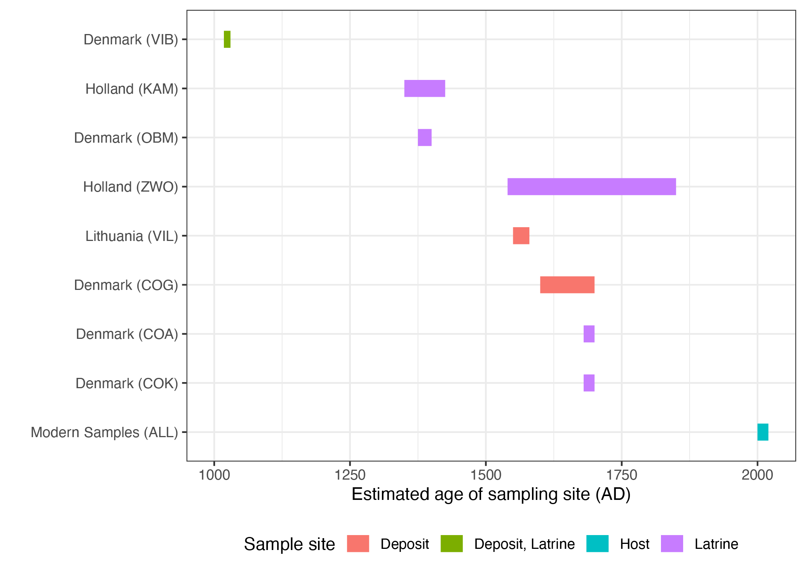
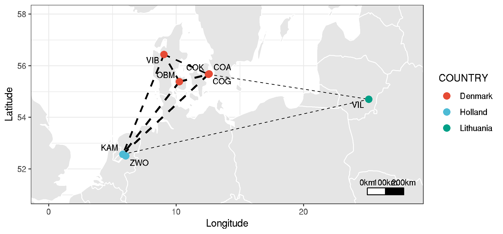

## Sampling sites
### World map
Given it is a "global diversity" study, worth having a world map with sampling sites, distinction between ancient and modern samples, and the fact that some some from humans, animals, and the environment (ancient).

```R
setwd("/nfs/users/nfs_s/sd21/lustre118_link/trichuris_trichiura/05_ANALYSIS/MAP")

# load libraries
library(ggplot2)
library(dplyr)
require(maps)
library(ggrepel)
library(patchwork)
library(ggsci)

# load world data
world_map <- map_data("world")

# load metadata
data <- read.delim("map_metadata.txt", sep="\t", header=T)

# make a map
ggplot() +
     geom_polygon(data = world_map, aes(x = world_map$long, y = world_map$lat, group = world_map$group), fill="grey90") +
     geom_point(data = data, aes(x = LONGITUDE, y = LATITUDE, colour = REGION, shape = SAMPLE_AGE), size=3) +
     geom_text_repel(data = data, aes(x = LONGITUDE, y = LATITUDE, label = paste0(COUNTRY," (",POPULATION_ID,"); n = ", SAMPLE_N)), size=3, max.overlaps = Inf) +
     theme_void() +
     ylim(-55,85) +
     labs(title="A", colour="", shape="") +
     scale_colour_npg()

# save it
ggsave("worldmap_samplingsites.png", height=5, width=12)
ggsave("worldmap_samplingsites.pdf", height=5, width=12, useDingbats=FALSE)

```

- will use this as Figure 1A


### Sampling timepoints

```R
library(ggplot2)

data <- read.delim("ancient_times.txt",header=F,sep="\t")

ggplot(data, aes(x=V11,xend=V12,y=reorder(paste0(V1," (",V4,")"),V11,FUN=mean),yend=paste0(V1," (",V4,")"), colour=V10)) +
     geom_segment(size=5) +
     xlim(1000,2020) +
     labs(x = "Estimated age of sampling site (AD)", y = "", colour = "Sample site") +
     scale_y_discrete(limits=rev) +
     theme_bw() + theme(legend.position="bottom")

ggsave("samplingsites_time.png", height=5, width=7)
ggsave("samplingsites_time.pdf", height=5, width=7, useDingbats=FALSE)

```

Figure: [map](../04_analysis/sampling_sites_and_data/samplingsites_time.pdf)
- will use this in the supplementary data



## Map of ancient DNA sites, with Fst data showing degree of connectivity between populations
- note: this uses data described in the genome-wide genetic variation code

```bash
# working directory
cd /nfs/users/nfs_s/sd21/lustre118_link/trichuris_trichiura/05_ANALYSIS/MAP
```

```R

library(tidyverse)
require(maps)
library(ggrepel)
library(patchwork)
library(ggsci)

library(maptools)
library(grid)

# load world data
world_map <- map_data("world")


# code for the scale bar - need to cut and paste some functions from here: https://egallic.fr/en/scale-bar-and-north-arrow-on-a-ggplot2-map/

create_scale_bar <- function(lon,lat,distance_lon,distance_lat,distance_legend, dist_units = "km"){
    # First rectangle
    bottom_right <- gcDestination(lon = lon, lat = lat, bearing = 90, dist = distance_lon, dist.units = dist_units, model = "WGS84")

    topLeft <- gcDestination(lon = lon, lat = lat, bearing = 0, dist = distance_lat, dist.units = dist_units, model = "WGS84")
    rectangle <- cbind(lon=c(lon, lon, bottom_right[1,"long"], bottom_right[1,"long"], lon),
    lat = c(lat, topLeft[1,"lat"], topLeft[1,"lat"],lat, lat))
    rectangle <- data.frame(rectangle, stringsAsFactors = FALSE)

    # Second rectangle t right of the first rectangle
    bottom_right2 <- gcDestination(lon = lon, lat = lat, bearing = 90, dist = distance_lon*2, dist.units = dist_units, model = "WGS84")
    rectangle2 <- cbind(lon = c(bottom_right[1,"long"], bottom_right[1,"long"], bottom_right2[1,"long"], bottom_right2[1,"long"], bottom_right[1,"long"]),
    lat=c(lat, topLeft[1,"lat"], topLeft[1,"lat"], lat, lat))
    rectangle2 <- data.frame(rectangle2, stringsAsFactors = FALSE)

    # Now let's deal with the text
    on_top <- gcDestination(lon = lon, lat = lat, bearing = 0, dist = distance_legend, dist.units = dist_units, model = "WGS84")
    on_top2 <- on_top3 <- on_top
    on_top2[1,"long"] <- bottom_right[1,"long"]
    on_top3[1,"long"] <- bottom_right2[1,"long"]

    legend <- rbind(on_top, on_top2, on_top3)
    legend <- data.frame(cbind(legend, text = c(0, distance_lon, distance_lon*2)), stringsAsFactors = FALSE, row.names = NULL)
    return(list(rectangle = rectangle, rectangle2 = rectangle2, legend = legend))
}

create_orientation_arrow <- function(scale_bar, length, distance = 1, dist_units = "km"){
    lon <- scale_bar$rectangle2[1,1]
    lat <- scale_bar$rectangle2[1,2]

    # Bottom point of the arrow
    beg_point <- gcDestination(lon = lon, lat = lat, bearing = 0, dist = distance, dist.units = dist_units, model = "WGS84")
    lon <- beg_point[1,"long"]
    lat <- beg_point[1,"lat"]

    # Let us create the endpoint
    on_top <- gcDestination(lon = lon, lat = lat, bearing = 0, dist = length, dist.units = dist_units, model = "WGS84")

    left_arrow <- gcDestination(lon = on_top[1,"long"], lat = on_top[1,"lat"], bearing = 225, dist = length/5, dist.units = dist_units, model = "WGS84")

    right_arrow <- gcDestination(lon = on_top[1,"long"], lat = on_top[1,"lat"], bearing = 135, dist = length/5, dist.units = dist_units, model = "WGS84")

    res <- rbind(
            cbind(x = lon, y = lat, xend = on_top[1,"long"], yend = on_top[1,"lat"]),
            cbind(x = left_arrow[1,"long"], y = left_arrow[1,"lat"], xend = on_top[1,"long"], yend = on_top[1,"lat"]),
            cbind(x = right_arrow[1,"long"], y = right_arrow[1,"lat"], xend = on_top[1,"long"], yend = on_top[1,"lat"]))

    res <- as.data.frame(res, stringsAsFactors = FALSE)

    # Coordinates from which "N" will be plotted
    coords_n <- cbind(x = lon, y = (lat + on_top[1,"lat"])/2)

    return(list(res = res, coords_n = coords_n))
}

scale_bar <- function(lon, lat, distance_lon, distance_lat, distance_legend, dist_unit = "km", rec_fill = "white", rec_colour = "black", rec2_fill = "black", rec2_colour = "black", legend_colour = "black", legend_size = 3, orientation = TRUE, arrow_length = 500, arrow_distance = 300, arrow_north_size = 6){
    the_scale_bar <- create_scale_bar(lon = lon, lat = lat, distance_lon = distance_lon, distance_lat = distance_lat, distance_legend = distance_legend, dist_unit = dist_unit)
    # First rectangle
    rectangle1 <- geom_polygon(data = the_scale_bar$rectangle, aes(x = lon, y = lat), fill = rec_fill, colour = rec_colour)

    # Second rectangle
    rectangle2 <- geom_polygon(data = the_scale_bar$rectangle2, aes(x = lon, y = lat), fill = rec2_fill, colour = rec2_colour)

    # Legend
    scale_bar_legend <- annotate("text", label = paste(the_scale_bar$legend[,"text"], dist_unit, sep=""), x = the_scale_bar$legend[,"long"], y = the_scale_bar$legend[,"lat"], size = legend_size, colour = legend_colour)

    res <- list(rectangle1, rectangle2, scale_bar_legend)

    if(orientation){# Add an arrow pointing North
        coords_arrow <- create_orientation_arrow(scale_bar = the_scale_bar, length = arrow_length, distance = arrow_distance, dist_unit = dist_unit)
        arrow <- list(geom_segment(data = coords_arrow$res, aes(x = x, y = y, xend = xend, yend = yend)), annotate("text", label = "N", x = coords_arrow$coords_n[1,"x"], y = coords_arrow$coords_n[1,"y"], size = arrow_north_size, colour = "black"))
        res <- c(res, arrow)
    }
    return(res)
}


data <- read.delim("map_metadata_ancient.txt", sep="\t", header=T)
fst <- read.delim("map_fst_data.txt", sep="\t", header=T)

ggplot() +
     geom_polygon(data = world_map, aes(x = long, y = lat, group = group), fill="grey90",col="white") +
     geom_segment(data=fst, aes(x=POP1_LONG , y=POP1_LAT, xend=POP2_LONG , yend=POP2_LAT, size=1-FST ),linetype="dashed")+
     geom_point(data = data, aes(x = LONGITUDE, y = LATITUDE, colour = COUNTRY), size=3) +
     geom_text_repel(data = data, aes(x = LONGITUDE, y = LATITUDE, label = POPULATION_ID), size=3)+
     coord_cartesian(xlim = c(0,28), ylim = c(51,58))+
     scale_colour_npg()+
     scale_size_continuous(range = c(0, 1), guide = 'none')+
     theme_bw()+ labs(x="Longitude", y="Latitude") +
     scale_bar(lon = 25, lat = 51,
     distance_lon = 100, distance_lat = 30, distance_legend = 54,
     dist_unit = "km", orientation = FALSE)

ggsave("ancient_sites_fst_map.png", height=3.5, width=7.5)
ggsave("ancient_sites_fst_map.pdf", height=3.5, width=7.5, useDingbats=FALSE)
```

Figure: [map](../04_analysis/sampling_sites_and_data/ancient_sites_fst_map.pdf)
- new main text figure

