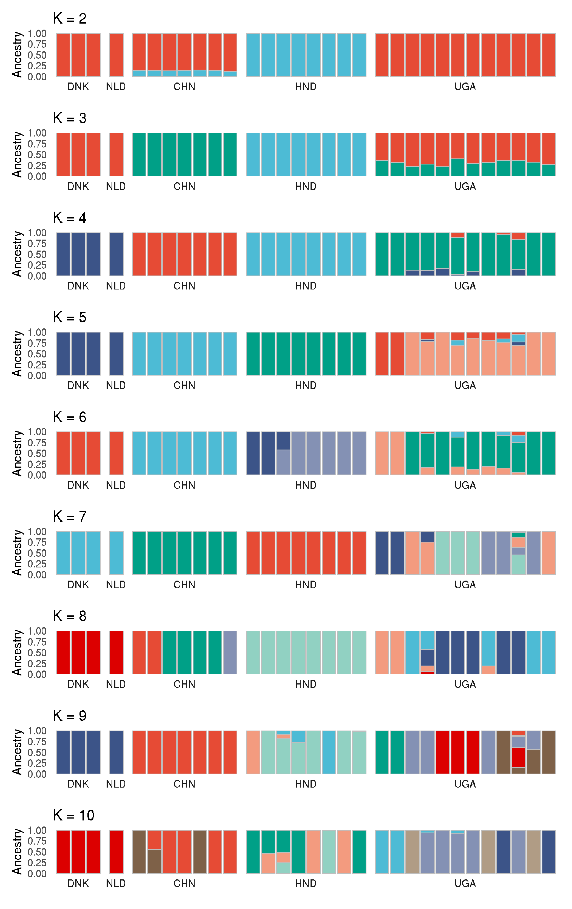

## NGSadmix

```bash

mkdir /nfs/users/nfs_s/sd21/lustre118_link/trichuris_trichiura/05_ANALYSIS/ADMIXTURE

cd /nfs/users/nfs_s/sd21/lustre118_link/trichuris_trichiura/05_ANALYSIS/ADMIXTURE

mkdir CHROMOSOMES_PL

ln -s /nfs/users/nfs_s/sd21/lustre118_link/trichuris_trichiura/04_VARIANTS/GATK_HC_MERGED/nuclear_samples3x_missing0.8_animalPhonly.recode.vcf.gz

cat ../../01_REF/trichuris_trichiura.fa.fai | cut -f1 | grep -v "MITO" | while read -r CHR; do
     vcftools --gzvcf ../../04_VARIANTS/GATK_HC_MERGED/nuclear_samples3x_missing0.8_animalPhonly.recode.vcf.gz  --max-missing 1 --out CHROMOSOMES_PL/${CHR} --BEAGLE-PL --chr ${CHR};
done

# merge the data from individual chromosomes into a single dataset
cd CHROMOSOMES_PL

cat $(ls -1 *PL | head -n1 ) | head -n1 > merged.PL

for i in *BEAGLE.PL; do
     cat ${i} | grep -v "marker" >> merged.PL;
done

# chromosomes=$(cat ../../01_REF/trichuris_trichiura.fa.fai | cut -f1 | grep -v "MITO" | while read -r CHROMOSOME; do printf "$CHROMOSOME,"; done | sed 's/,$//g')
# vcftools --gzvcf ../../04_VARIANTS/GATK_HC_MERGED/nuclear_samples3x_missing0.8_animalPhonly.recode.vcf.gz  --out CHROMOSOMES_PL/all_chromosomes --BEAGLE-PL --chr ${chromosomes}

head -n1 Trichuris_trichiura_3_009.BEAGLE.PL > chromosome.PL

# cat Trichuris_trichiura_1_001.BEAGLE.PL Trichuris_trichiura_1_002.BEAGLE.PL Trichuris_trichiura_1_003.BEAGLE.PL Trichuris_trichiura_1_004.BEAGLE.PL Trichuris_trichiura_1_005.BEAGLE.PL Trichuris_trichiura_1_006.BEAGLE.PL Trichuris_trichiura_1_007.BEAGLE.PL Trichuris_trichiura_2_001.BEAGLE.PL Trichuris_trichiura_3_001.BEAGLE.PL Trichuris_trichiura_3_002.BEAGLE.PL Trichuris_trichiura_3_003.BEAGLE.PL Trichuris_trichiura_3_004.BEAGLE.PL Trichuris_trichiura_3_005.BEAGLE.PL Trichuris_trichiura_3_006.BEAGLE.PL Trichuris_trichiura_3_007.BEAGLE.PL Trichuris_trichiura_3_008.BEAGLE.PL Trichuris_trichiura_3_009.BEAGLE.PL Trichuris_trichiura_3_010.BEAGLE.PL | grep -v "marker" | sort -t ":" -k1,1 -k2,2n >> chromosome.PL

# post revision update - only used autosomal variants
cat Trichuris_trichiura_2_001.BEAGLE.PL Trichuris_trichiura_3_001.BEAGLE.PL Trichuris_trichiura_3_002.BEAGLE.PL Trichuris_trichiura_3_003.BEAGLE.PL Trichuris_trichiura_3_004.BEAGLE.PL Trichuris_trichiura_3_005.BEAGLE.PL Trichuris_trichiura_3_006.BEAGLE.PL Trichuris_trichiura_3_007.BEAGLE.PL Trichuris_trichiura_3_008.BEAGLE.PL Trichuris_trichiura_3_009.BEAGLE.PL Trichuris_trichiura_3_010.BEAGLE.PL | grep -v "marker" | sort -t ":" -k1,1 -k2,2n >> chromosome.PL

cd ../


# run admixture for multiple values of K
for j in 1 2 3 4 5; do
     for i in 2 3 4 5 6 7 8 9 10; do
          bsub.py --queue long --threads 10 3 NGS_admix_multiK_rerun "NGSadmix -likes CHROMOSOMES_PL/chromosome.PL -K ${i} -P 10 -seed ${j} -minMaf 0.05 -misTol 0.9 -o k_${i}_s_${j}_out" ;
     done;
done


```

### make some admixture plots

```R
# load libraries
library(ggsci)
library(patchwork)
library(tidyverse)
library(reshape2)

# make a function
plot_admixture <- function(data,title) {

# get metadata
samples <- read.delim("nuclear_3x_animalPhonly.list", header=F)
names(samples) <- "sample_ID"
metadata <- samples %>% separate(sample_ID,c("time", "country","population","host","sampleID"))

# read data
data <- read.delim(data, sep=" ", header=F)
names(data) <- paste("ancestral", 1:ncol(data), sep="")

# bring metadata and data together
data <- cbind(samples, metadata,data)
data <- melt(data, id.vars=c("sample_ID","time", "country","population","host","sampleID"))

# make plot
ggplot(data,aes(sample_ID,value,fill=variable)) +
     geom_col(color = "gray", size = 0.1)+
     facet_grid(~fct_inorder(country), switch = "x", scales = "free", space = "free") +
     theme_minimal() + labs(title = title, y = "Ancestry", x = NULL) +
     scale_y_continuous(expand = c(0, 0)) +
     scale_x_discrete(expand = expansion(add = 0.7)) +
     theme(panel.spacing.x = unit(0.1, "lines"),
          axis.text.x = element_blank(),
          #axis.text.x = element_text(angle = 90, vjust = 0.5, hjust=1),
          panel.grid = element_blank()) +
     scale_fill_npg(guide = "none")
}

s = 3
# run function for each value of K
k_2_plot <- plot_admixture(paste0("k_2_s_",s,"_out.qopt"), "K = 2")
k_3_plot <- plot_admixture(paste0("k_3_s_",s,"_out.qopt"), "K = 3")
k_4_plot <- plot_admixture(paste0("k_4_s_",s,"_out.qopt"), "K = 4")
k_5_plot <- plot_admixture(paste0("k_5_s_",s,"_out.qopt"), "K = 5")
k_6_plot <- plot_admixture(paste0("k_6_s_",s,"_out.qopt"), "K = 6")
k_7_plot <- plot_admixture(paste0("k_7_s_",s,"_out.qopt"), "K = 7")
k_8_plot <- plot_admixture(paste0("k_8_s_",s,"_out.qopt"), "K = 8")
k_9_plot <- plot_admixture(paste0("k_9_s_",s,"_out.qopt"), "K = 9")
k_10_plot <- plot_admixture(paste0("k_10_s_",s,"_out.qopt"), "K = 10")

# bring the plots together
k_2_plot + k_3_plot + k_4_plot + k_5_plot + k_6_plot + k_7_plot + k_8_plot + k_9_plot + k_10_plot + plot_layout(ncol=1)

# save it
ggsave("admixture_plots_k2-10.png")
ggsave("admixture_plots_k2-10.pdf", height=15, width=10)

k_3_plot
ggsave("admixture_plots_k3.pdf", height=1.5, width=10)

```



- need to determine the optimal K, at least from what the data suggests.
- usually there is a cross validation approach for tools like STRUCTURE and ADMIXTURE, but there doesnt seem to be one for NGSadmix


### Clumpak
- rather that the above code, I ended up using Clumpak as suggested here: https://github.com/alexkrohn/AmargosaVoleTutorials/blob/master/ngsAdmix_tutorial.md

```bash
(for log in `ls k*.log`; do
     grep -Po 'like=\K[^ ]+' $log;
done) > logfile

```

- to collate the data, and generate a clumpak compatible input file

```R

logs <- as.data.frame(read.table("logfile"))

logs$K <- c(rep("10", 5), rep("2", 5), rep("3", 5), rep("4", 5), rep("5", 5), rep("6", 5), rep("7", 5), rep("8", 5), rep("9", 5))

write.table(logs[, c(2, 1)], "logfile_formatted", row.names = F,
    col.names = F, quote = F)

```


- open clumpak and upload the data
- the output suggests k=3 is the optimal ancestral number, which I guess is consistent with the PCA which produces three main clusters.
