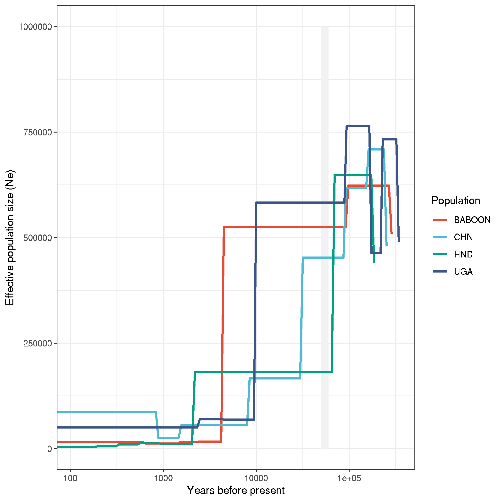

## SMC++
- want to calculate historical population sizes
- also want to follow up on question posed in Soe draft on the relationship between UGA and DNK samples

```bash

mkdir /nfs/users/nfs_s/sd21/lustre118_link/trichuris_trichiura/05_ANALYSIS/SMC

cd /nfs/users/nfs_s/sd21/lustre118_link/trichuris_trichiura/05_ANALYSIS/SMC

mkdir SMC_DATA

ln -s /nfs/users/nfs_s/sd21/lustre118_link/trichuris_trichiura/04_VARIANTS/GATK_HC_MERGED/nuclear_samples3x_missing0.8_animalPhonly.recode.vcf

conda activate smcpp

export LD_LIBRARY_PATH=/lustre/scratch118/infgen/team133/sd21/software/anaconda2/envs/smcpp/lib/

module load common-apps/htslib/1.9.229

cat ../../01_REF/trichuris_trichiura.fa.fai | cut -f1 | grep -v "MITO" > chromosomes.list

#--- plot per populations
# HND
vcftools --gzvcf nuclear_samples3x_missing0.8_animalPhonly.recode.vcf.gz \
--indv MN_HND_OLA_HS_001 \
--indv MN_HND_OLA_HS_002 \
--indv MN_HND_OLA_HS_003 \
--indv MN_HND_OLA_HS_004 \
--indv MN_HND_OLA_HS_005 \
--indv MN_HND_OLA_HS_006 \
--indv MN_HND_OLA_HS_007 \
--indv MN_HND_SAL_HS_001 \
--max-missing 1 --recode --out HND
bgzip -f HND.recode.vcf
tabix HND.recode.vcf.gz

# first estimate each population marginally using estimate:
while read CHROMOSOME; do
     smc++ vcf2smc HND.recode.vcf.gz SMC_DATA/HND.${CHROMOSOME}.smc.gz ${CHROMOSOME} HND:MN_HND_OLA_HS_001,MN_HND_OLA_HS_002,MN_HND_OLA_HS_003,MN_HND_OLA_HS_004,MN_HND_OLA_HS_005,MN_HND_OLA_HS_006,MN_HND_OLA_HS_007,MN_HND_SAL_HS_001;
done < chromosomes.list

# mutation rate (C.elegans) = 2.7e-9 (https://doi.org/10.1073/pnas.0904895106)
smc++ estimate -o HND/ 2.7e-9 SMC_DATA/HND.*.smc.gz

# plot
smc++ plot -g 0.33 -c SMCPP_HND.pdf HND/model.final.json


#--- CHN
vcftools --gzvcf nuclear_samples3x_missing0.8_animalPhonly.recode.vcf.gz \
--indv MN_CHN_GUA_HS_001 \
--indv MN_CHN_GUA_HS_002 \
--indv MN_CHN_GUA_HS_003 \
--indv MN_CHN_GUA_HS_004 \
--indv MN_CHN_GUA_HS_005 \
--indv MN_CHN_GUA_HS_006 \
--indv MN_CHN_GUA_HS_007 \
--max-missing 1 --recode --out CHN
bgzip -f CHN.recode.vcf
tabix CHN.recode.vcf.gz

# first estimate each population marginally using estimate:
while read CHROMOSOME; do
     smc++ vcf2smc CHN.recode.vcf.gz SMC_DATA/CHN.${CHROMOSOME}.smc.gz ${CHROMOSOME} CHN:MN_CHN_GUA_HS_001,MN_CHN_GUA_HS_002,MN_CHN_GUA_HS_003,MN_CHN_GUA_HS_004,MN_CHN_GUA_HS_005,MN_CHN_GUA_HS_006,MN_CHN_GUA_HS_007;
done < chromosomes.list

# mutation rate (C.elegans) = 2.7e-9 (https://www.pnas.org/content/106/38/163100)
smc++ estimate -o CHN/ 2.7e-9 SMC_DATA/CHN.*.smc.gz

# plot
smc++ plot -g 0.33 -c SMCPP_CHN.pdf CHN/model.final.json


#--- ANCIENT
vcftools --gzvcf nuclear_samples3x_missing0.8_animalPhonly.recode.vcf.gz \
--indv AN_DNK_COG_EN_0012 \
--indv AN_NLD_KAM_EN_0034 \
--max-missing 1 --recode --out ANCIENT
bgzip -f ANCIENT.recode.vcf
tabix ANCIENT.recode.vcf.gz

# first estimate each population marginally using estimate:
while read CHROMOSOME; do
     smc++ vcf2smc ANCIENT.recode.vcf.gz SMC_DATA/ANCIENT.${CHROMOSOME}.smc.gz ${CHROMOSOME} ANCIENT:AN_DNK_COG_EN_0012,AN_NLD_KAM_EN_0034;
done < chromosomes.list

# mutation rate (C.elegans) = 2.7e-9 (https://www.pnas.org/content/106/38/163100)
smc++ estimate -o ANCIENT/ 2.7e-9 SMC_DATA/ANCIENT.*.smc.gz

# plot
smc++ plot -g 0.33 -c SMCPP_ANCIENT.pdf ANCIENT/model.final.json


#--- Baboon
vcftools --gzvcf nuclear_samples3x_missing0.8_animalPhonly.recode.vcf.gz \
--indv MN_DNK_COZ_PH_001 \
--indv MN_DNK_COZ_PH_002 \
--max-missing 1 --recode --out BABOON

bgzip -f BABOON.recode.vcf
tabix BABOON.recode.vcf.gz

# first estimate each population marginally using estimate:
while read CHROMOSOME; do
     smc++ vcf2smc BABOON.recode.vcf.gz SMC_DATA/BABOON.${CHROMOSOME}.smc.gz ${CHROMOSOME} BABOON:MN_DNK_COZ_PH_001,MN_DNK_COZ_PH_002;
done < chromosomes.list

# mutation rate (C.elegans) = 2.7e-9 (https://www.pnas.org/content/106/38/163100)
smc++ estimate -o BABOON/ 2.7e-9 SMC_DATA/BABOON.*.smc.gz

# plot
smc++ plot -g 0.33 -c SMCPP_BABOON.pdf BABOON/model.final.json


#--- UGA
vcftools --gzvcf nuclear_samples3x_missing0.8_animalPhonly.recode.vcf.gz \
--indv MN_UGA_DK_HS_001 \
--indv MN_UGA_DK_HS_002 \
--indv MN_UGA_DK_HS_003 \
--indv MN_UGA_KAB_HS_001 \
--indv MN_UGA_KAB_HS_002 \
--indv MN_UGA_KAB_HS_003 \
--indv MN_UGA_KAB_HS_004 \
--indv MN_UGA_KAB_HS_005 \
--indv MN_UGA_KAB_HS_006 \
--indv MN_UGA_KAB_HS_007 \
--indv MN_UGA_KAB_HS_008 \
--indv MN_UGA_KAB_HS_009 \
--max-missing 1 --recode --out UGA

bgzip -f UGA.recode.vcf
tabix UGA.recode.vcf.gz

# first estimate each population marginally using estimate:
while read CHROMOSOME; do
     smc++ vcf2smc UGA.recode.vcf.gz SMC_DATA/UGA.${CHROMOSOME}.smc.gz ${CHROMOSOME} UGA:MN_UGA_DK_HS_001,MN_UGA_DK_HS_002,MN_UGA_DK_HS_003,MN_UGA_KAB_HS_001,MN_UGA_KAB_HS_002,MN_UGA_KAB_HS_003,MN_UGA_KAB_HS_004,MN_UGA_KAB_HS_005,MN_UGA_KAB_HS_006,MN_UGA_KAB_HS_007,MN_UGA_KAB_HS_008,MN_UGA_KAB_HS_009;
done < chromosomes.list

# mutation rate (C.elegans) = 2.7e-9 (https://www.pnas.org/content/106/38/163100)
smc++ estimate -o UGA/ 2.7e-9 SMC_DATA/UGA.*.smc.gz

# plot
smc++ plot -g 0.33 -c SMCPP_UGA.pdf UGA/model.final.json

```

- plot all smcpp plots together

```R
# load libraries
library(tidyverse)
library(patchwork)
library(ggsci)

# load data
HND_data <- read.delim("SMCPP_HND.csv", header = T , sep = ",")
HND_data$ID <- "HND"
CHN_data <- read.delim("SMCPP_CHN.csv", header = T , sep = ",")
CHN_data$ID <- "CHN"
#ANCIENT_data <- read.delim("SMCPP_ANCIENT.csv", header = T , sep = ",")
#ANCIENT_data$ID <- "ANCIENT"
BABOON_data <- read.delim("SMCPP_BABOON.csv", header = T , sep = ",")
BABOON_data$ID <- "BABOON"
UGA_data <- read.delim("SMCPP_UGA.csv", header = T , sep = ",")
UGA_data$ID <- "UGA"

data <- bind_rows(HND_data, CHN_data, BABOON_data, UGA_data)


ggplot(data,aes(x,y,col=ID)) +
     geom_rect(aes(xmin=50000,ymin=0,xmax=60000,ymax=1.0E6), fill="grey95", col=NA) +
     geom_line(size=1) +
     labs(x = "Years before present", y = "Effective population size (Ne)", col="Population") +
     theme_bw() +
     scale_x_log10(labels = prettyNum) +
     ylim(0,1e6) +
     scale_colour_npg()

ggsave("plot_smcpp_all_populations.png")
ggsave("plot_smcpp_all_populations.pdf", height = 4, width = 5, useDingbats = FALSE)

```

Figure: [plot_smcpp_all_populations](plot_smcpp_all_populations.pdf)
- use this in Figure 2 panel D


