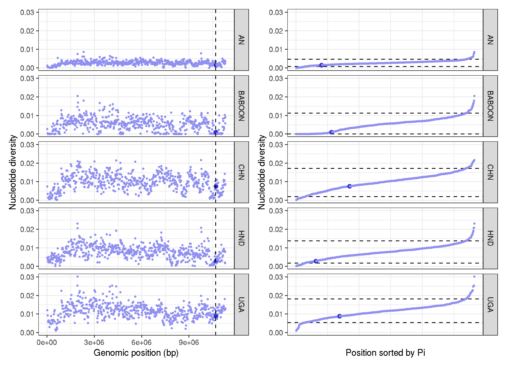

## Analysis of variation within beta tubulin
```bash
vcftools \
      --gzvcf Trichuris_trichiura.cohort.nuclear_variants.final.recode.vcf.gz \
      --bed btubulin.exons.bed \
      --site-pi \
      --keep mod_human_samples.list \
      --maf 0.01 \
      --out BZ_nuc_div

#> After filtering, kept 42 out of 73 Individuals
#> After filtering, kept 9 out of a possible 6571976 Sites

vcftools \
      --gzvcf Trichuris_trichiura.cohort.nuclear_variants.final.recode.vcf.gz \
      --bed btubulin.exons.bed \
      --freq \
      --keep mod_human_samples.list \
      --maf 0.01 \
      --out BZ_allele_freq

vcftools \
      --gzvcf Trichuris_trichiura.cohort.nuclear_variants.final.recode.vcf.gz \
      --bed btubulin.exons.bed \
      --hardy \
      --keep mod_human_samples.list \
      --maf 0.01 \
      --out BZ_hardy


```

```R
# load library
library(tidyverse)
library(ggsci)
library(patchwork)
library(viridis)
library(ggrepel)

# load data
exons <- read.table("btubulin.exons.bed", header=T)
nuc <- read.table("out.sites.pi", header=T)
resistant_snps <- read.table("btubulin.canonicalresistantSNPs.bed",header=T)

allele_freq <- read.table("BZ_allele_freq.frq2", header=F, sep="\t", skip=1)
colnames(allele_freq) <- c("chrom", "pos", "alleles", "total_alleles", "ref", "ref_freq", "var", "var_freq")

# original
# ggplot() +
#      geom_segment(data=exons, aes(x=min(start),xend=max(end),y=0.5,yend=0.5),col="black", size=2) +
#      geom_rect(data=exons,aes(xmin=start,ymin=0,xmax=end,ymax=1),fill="grey80") +
#      ylim(-0.5,1.5) +
#      labs(title="Beta-tubulin (TTRE_0000877201)",x="Genomic position (bp)", y="") +
#      geom_segment(data=resistant_snps, aes(x=start,xend=end,y=0,yend=1),col="orange", size=1) +
#      geom_segment(data=nuc, aes(x=POS,xend=POS,y=0,yend=1,col=PI), size=2) +
#      theme_bw() + theme(axis.title.y=element_blank(),
#           axis.text.y=element_blank(),
#           axis.ticks.y=element_blank())

# ggsave("btubulin_variation_gene.png")
# ggsave("btubulin_variation_gene.pdf", height=2, width=5)


# post peer review
ggplot() +
     geom_segment(data=exons, aes(x=min(start), xend=max(end),y=0,yend=0), col="black", size=2) +
     geom_rect(data=exons, aes(xmin=start,ymin=-0.1, xmax=end, ymax=0.1), fill="grey80") +
     ylim(-1,1) +
     labs(title="Beta-tubulin (TTRE_0000877201)",x="Genomic position (bp)", y="Minor allele frequency (neg) + Nucleotide diversity (pos)", color="Frequency") +
     geom_segment(data=resistant_snps, aes(x=start, xend=end, y=-0.1, yend=0.1),col="red", size=1) +
     geom_text_repel(data=resistant_snps, aes(x=start, y=0, label=start), col="red", box.padding = 0.5, max.overlaps = Inf, nudge_y = 0.75) +
     geom_segment(data=nuc, aes(x=POS, xend=POS, y=0, yend=PI, col=PI), size=1) +
     geom_point(data=nuc, aes(x=POS, y=PI, col=PI), size=3) +
     geom_segment(data=allele_freq, aes(x=pos, xend=pos, y=0, yend=-var_freq, col=var_freq), size=1) +
     geom_point(data=allele_freq, aes(x=pos, y=-var_freq, col=var_freq), size=3) +
     theme_bw() + scale_colour_viridis()  + scale_fill_viridis()


ggsave("btubulin_variation_gene_R1.png")
ggsave("btubulin_variation_gene_R1.pdf", height=2, width=5)


file_names <-
     list.files(path = "./",pattern = "_x_nuclear_3x_animalPhonly_50k.windowed.pi")

      # load data using file names, and make a formatted data frame
nucdiv <-
     purrr::map_df(file_names, function(x) {
 	data <- read.delim(x, header = T, sep="\t")
     data <- tibble::rowid_to_column(data, "NUM")
 	cbind(pop_id = gsub("_x_nuclear_3x_animalPhonly_50k.windowed.pi","",x), data)
 	})

nucdiv <-
     dplyr::filter(nucdiv, grepl('Trichuris_trichiura_1_001', CHROM))


plot_btub_pi <-
     ggplot(nucdiv,aes(NUM*50000,PI,col=CHROM, group=pop_id)) +
     geom_point() +
     labs(x = "Genomic position (bp)" , y = "Nucleotide diversity (Pi)", col=NA) +
     facet_grid(pop_id~.) +
     theme_bw() + theme(legend.position = "none") +
     geom_vline(xintercept=c(10684531,10686350))


file_names <- list.files(path = "./",pattern = "_x_nuclear_3x_animalPhonly_50k.Tajima.D")

tajD <-
     purrr::map_df(file_names, function(x) {
          data <- read.delim(x, header = T, sep="\t")
          data <- tibble::rowid_to_column(data, "NUM")
      	cbind(pop_id = gsub("_x_nuclear_3x_animalPhonly_50k.Tajima.D","",x), data)
      	})

tajD <- dplyr::filter(tajD, grepl('Trichuris_trichiura_1_001', CHROM))


plot_btub_taj <-
     ggplot(tajD,aes(NUM*50000,TajimaD,col=CHROM, group=pop_id)) +
     geom_point() +
     labs(x = "Genomic position (bp)" , y = "Tajimas D", col=NA) +
     facet_grid(pop_id~.) +
     theme_bw() + theme(legend.position = "none") +
     geom_vline(xintercept=c(10684531,10686350))

plot_btub_pi + plot_btub_taj + plot_layout(ncol=2)

ggsave("btubulin_variation_scaffold.png")
ggsave("btubulin_variation_scaffold.pdf")

```

